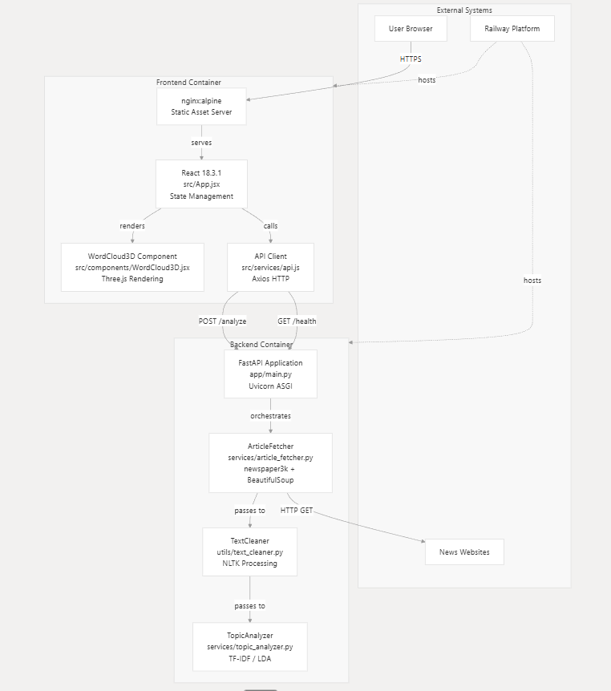
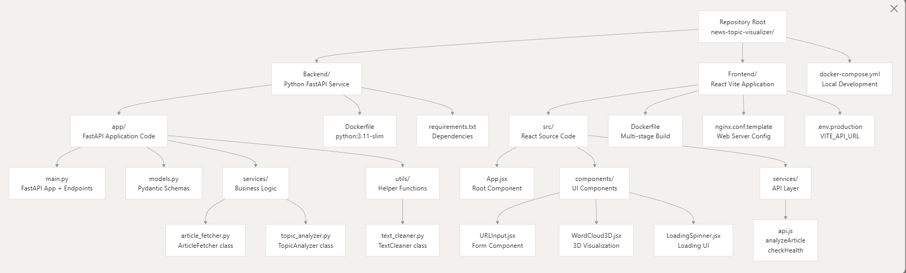
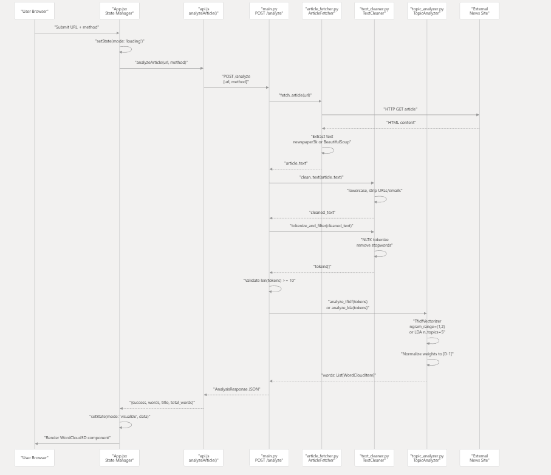

# News Topic Visualizer

Analyze a news article URL, extract keywords, and visualize them as an interactive 3D word cloud.

## Stack
- Backend: FastAPI, Newspaper3k, BeautifulSoup, NLTK, scikit‑learn (TF‑IDF), optional LDA
- Frontend: React + Vite, Three.js via react‑three‑fiber/drei, Nginx for static hosting
- Docker: Multi-stage images for both services; optional `docker-compose.yml` for local dev

## Repository Structure
- `Backend/` — FastAPI service (extraction, cleaning, scoring)
- `Frontend/` — React/Vite app (3D visualization)
- `docker-compose.yml` — optional local dev (runs both services)

## How It Works
1) Method toggle: choose TF‑IDF (default) or LDA in the UI.
2) Weights drive color, size, AND proximity to center.
3) Top Keywords side panel lists exact scores with bars.
4) Fetch article content (Newspaper3k → BeautifulSoup fallback).
5) Clean/tokenize with NLTK; remove stopwords and very short tokens.
6) Compute TF‑IDF (unigrams + bigrams), normalize scores to [0–1].
7) Render a 3D word cloud; size/color scale and centrality track normalized weight.

## Local Development (Docker Compose)
```bash
docker-compose up --build
```
- Frontend: http://localhost:3000
- Backend: http://localhost:8000

## Local Development (Without Docker)
### Backend
```bash
cd Backend
python -m venv .venv && source .venv/bin/activate   # Windows: .\.venv\Scripts\activate
pip install -r requirements.txt
uvicorn app.main:app --reload --host 0.0.0.0 --port 8000
```

### Frontend
```bash
cd Frontend
npm ci
echo "VITE_API_URL=http://localhost:8000" > .env.local
npm run dev
```

## API
- `GET /health` → `{"status":"healthy"}`
- `POST /analyze`
  - Body: `{"url": "<article_url>", "method": "tfidf" | "lda"}` (optional `method`, default `tfidf`)
  - Returns: `{ success, url, title, words: [{word, weight}], total_words, message }`
  - Note: Use actual article pages (not homepages). Short/JS‑heavy pages may be rejected.

## System Architecture Diagram



## Repository Layout Diagram



## End-to-End Processing Overview



## Deployment (Railway)
Deploy TWO services from the SAME repo.

### Backend service
- Root Directory: `Backend`
- Dockerfile Path: `Dockerfile`
- Healthcheck Path: `/health`
- The container binds to `${PORT}` (defaults to 8000 locally via Dockerfile CMD).

### Frontend service
- Root Directory: `Frontend`
- Dockerfile Path: `Dockerfile`
- Provide API URL at build time:
  - Easiest: commit `Frontend/.env.production` with `VITE_API_URL=https://<backend>.up.railway.app`
- Networking: target port `80`.

## Troubleshooting
- Frontend calling `localhost` in production: set `VITE_API_URL` for the production build and redeploy.
- “Article too short”: try a longer article or lower thresholds in the backend.
- Railway build issues: ensure each service uses the correct Root Directory + Dockerfile Path pairing.


